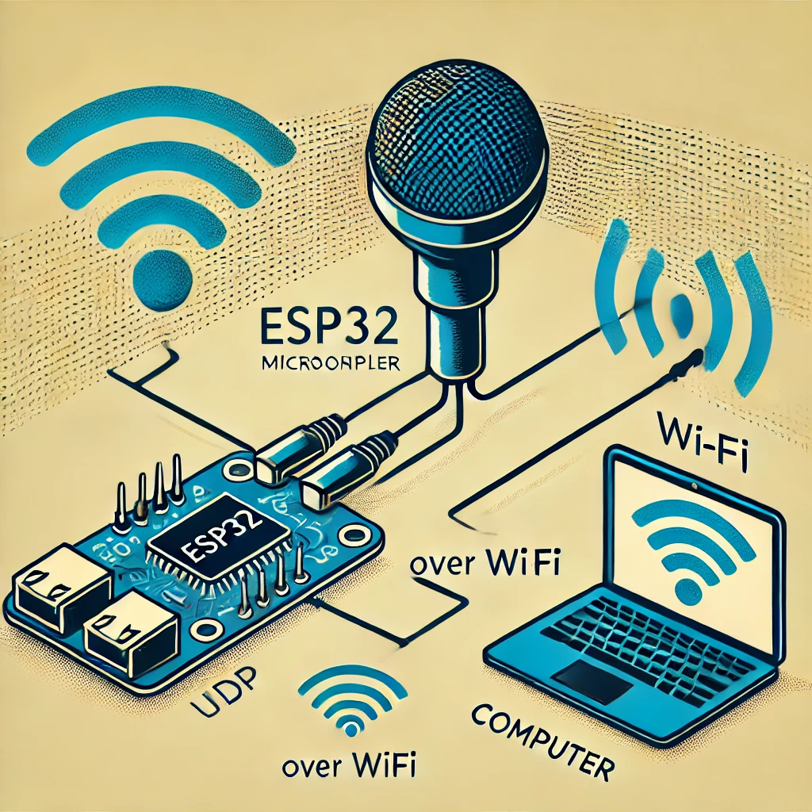

# Esp32 spy Captura y Procesamiento de Audio vía UDP

Este proyecto permite la captura y transmisión de datos de audio en tiempo real desde un dispositivo basado en ESP32 hacia una computadora. En la computadora, los datos son procesados, reproducidos, y guardados en un archivo `.wav`.



## Descripción General

Este repositorio contiene dos partes principales:
1. **Código para el ESP32**: Captura audio a través de I2S y lo transmite vía UDP a una IP y puerto específicos.
2. **Código para la Computadora**: Recibe, amplifica, reproduce, y guarda el audio en un archivo `.wav` utilizando sockets UDP.

## Requisitos

### Para el código de la computadora

1. **Python** con las siguientes bibliotecas:
   - `socket`
   - `pyaudio`
   - `numpy`
   - `wave`
   - `matplotlib` (opcional, si se desea realizar una visualización)

Instala las dependencias en Python con:
```bash
pip install pyaudio numpy
